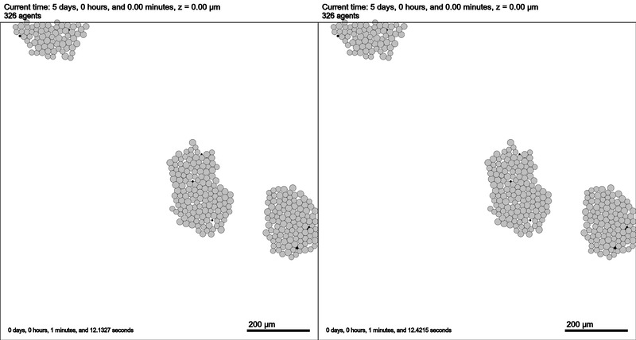
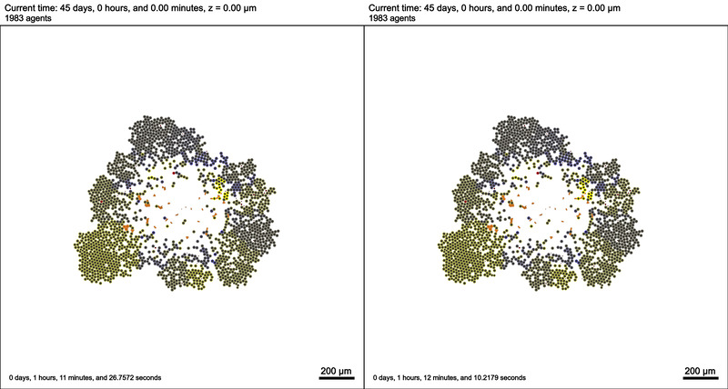
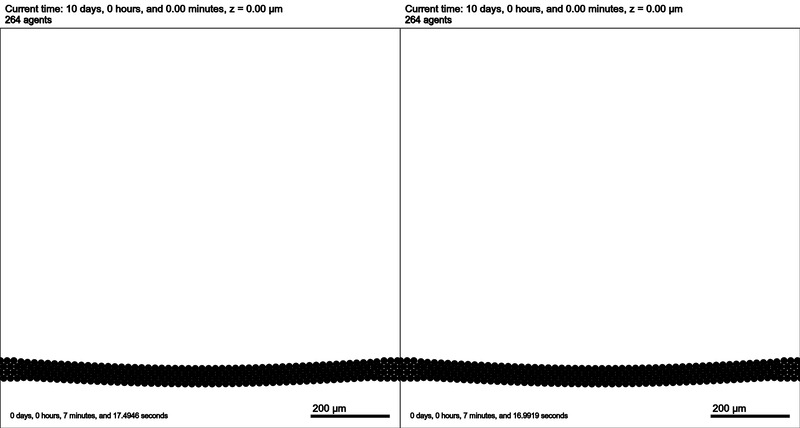
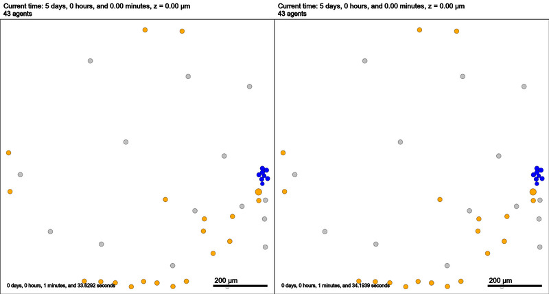
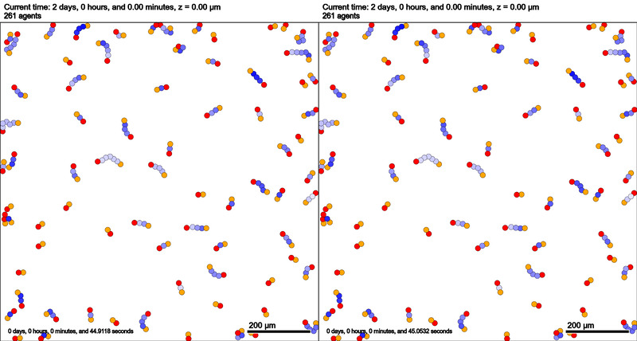

This test compares output results from 1.12.0 and the rheiland fork, dev branch where this issue is fixed: https://github.com/MathCancer/PhysiCell/issues/124#issuecomment-1589051078 . All sample projects were bitwise reproducible except for cancer_biorobots where, as show below, cell positions start to deviate slightly, starting ~7.5 days. 

Arrows point to at least one cluster of cells with slight deviation in positions.

